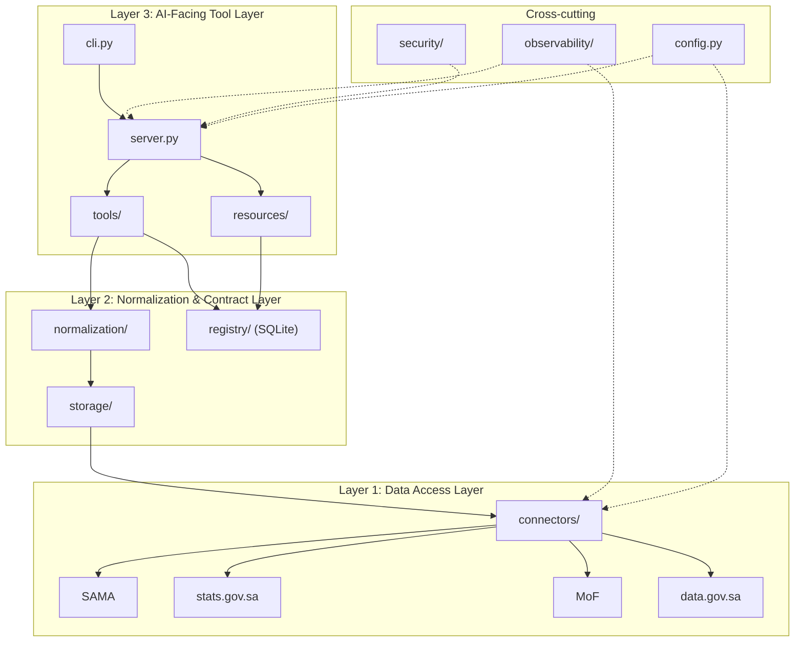

# Architecture

## Project Mission

`saudi-open-data-mcp` is a production-minded MCP server for Saudi open data sources.

The project does not treat MCP as the core product. MCP is the interface layer that exposes data access to clients. The core value is implemented below that interface through:

- source isolation
- normalized dataset contracts
- a dataset registry
- explicit freshness and degradation policy
- reliable AI-facing tool interfaces

## Assumptions for the Current Internal Baseline

- Current source scope is the current narrow curated set:
  - SAMA
  - three `stats.gov.sa` macro datasets
  - one Ministry of Finance fiscal dataset
  - one narrow `data.gov.sa` pilot dataset
- Python 3.12 is the runtime.
- FastMCP 2.x is the MCP framework.
- `httpx` is the only HTTP client. `requests` is out of scope.
- Container-first Streamable HTTP is the official internal serving path.
- STDIO remains supported for local development and command-based MCP host integration.
- Single-process deployment is assumed.
- Horizontal scaling is not a goal in the current baseline.
- Only approved official sources may be accessed by connectors.
- No LLM dependency is allowed in the core path.

## Current System Surfaces

The repository currently exposes four distinct but related surfaces:

- backend/core
  - the real governed runtime
  - includes the MCP server, registry, normalization, health, observability,
    security, and storage paths
- CLI
  - a thin local façade over the same core operations
  - does not define separate business logic
- dashboard
  - an Arabic RTL frontend package under `dashboard/`
  - optional live consumer of the governed backend surfaces
  - not part of the governed backend runtime today
- exports
  - institutional artifacts generated from governed query results
  - currently exposed through the CLI export path

This distinction matters operationally:

- the backend/core is the system of record in this repository
- the CLI is an operator/engineer convenience surface over that same record
- the dashboard is an optional live review surface, not a required runtime dependency
- exports are outputs of governed results, not a second interpretation layer

## Architectural Philosophy

The architecture separates source-specific code from normalized contracts and from MCP-facing orchestration.

This separation exists for operational reasons, not style:

- Source isolation limits the impact of upstream changes to connector modules and source-specific normalization mappings and validators.
- Typed normalized contracts keep AI-facing outputs deterministic. The enforcement mechanism is Pydantic v2 models for all normalized outputs.
- Registry-backed metadata prevents tool modules from inventing dataset descriptors or health state at request time. The enforcement mechanism is mandatory registry reads for dataset metadata and health metadata.
- MCP transports remain thin because business logic lives behind internal application orchestration, not inside MCP entry points. The enforcement mechanism is that `server.py`, `tools/`, and `resources/` expose MCP interfaces but do not fetch raw payloads or perform normalization, and connector resolution is pushed below `server.py`.

## Three-Layer Architecture

### 1. Data Access Layer

Purpose:

- fetch raw payloads from approved official sources
- isolate source-specific HTTP behavior
- apply retries and timeouts
- persist raw snapshots when needed

Primary modules:

- `connectors/`
- `storage/` for file-based snapshots and cache

Required mechanisms:

- `httpx` clients with explicit timeouts
- retry policy implemented inside connectors
- source allowlist enforced by connector configuration
- connector resolution by `descriptor.source` outside `server.py`
- raw payload snapshotting handled outside MCP-facing modules

### 2. Normalization and Contract Layer

Purpose:

- transform raw source payloads into canonical typed models
- validate field mappings
- define schema versions
- keep canonical contracts separate from source-specific payloads

Primary modules:

- `normalization/`
- `registry/`

Required mechanisms:

- Pydantic v2 models defined in `normalization/` for canonical outputs
- explicit mapping code from raw payload shape to canonical schema
- normalization dispatch by raw payload source
- validation logic kept inside `normalization/` and dispatched by source
- schema version identifiers stored in the registry
- registry-backed dataset descriptors, caveats, and health metadata stored in SQLite

### 3. AI-Facing Tool Layer

Purpose:

- expose deterministic MCP tools and resources
- support STDIO and Streamable HTTP transports
- orchestrate internal application logic without embedding source logic

Primary modules:

- `tools/`
- `resources/`
- `server.py`

Required mechanisms:

- thin MCP modules that call internal orchestration helpers rather than lower-level source code directly
- deterministic structured outputs from tools and resources
- transport wiring in `server.py` only

The repository also includes supporting modules that cut across these layers:

- `observability/`
- `security/`
- `config.py`

These supporting modules enforce operational boundaries across the three layers. They are not a fourth business layer.

## Module Boundaries and Responsibilities

### `connectors/`

Responsibilities:

- call approved official source endpoints
- define request URLs, headers, timeouts, and retry behavior
- return raw source payloads and source retrieval metadata

Must not:

- emit MCP responses
- expose free-form dictionaries as final public contracts
- write dataset descriptors or health metadata directly into tool responses

Enforcement:

- external I/O is concentrated in this package
- all upstream HTTP usage goes through `httpx`
- connector selection happens by source through a small resolver, not by branching in `server.py`
- downstream callers receive connector outputs through controlled internal orchestration and typed contracts

### `storage/`

Responsibilities:

- manage file-based raw snapshots and cache directories
- keep raw payload persistence concerns outside tool modules
- provide deterministic filesystem evidence for freshness evaluation

Must not:

- become the source of truth for dataset descriptors
- replace the registry for health or schema metadata

Enforcement:

- raw payload persistence lives under `storage/`
- SQLite remains the only registry metadata store
- snapshot writes replace final files only after a complete temp-file write in the same directory

### `normalization/`

Responsibilities:

- map raw connector payloads into canonical dataset models
- validate required fields and types
- define canonical typed outputs used by MCP-facing modules

Must not:

- fetch raw payloads directly from sources
- read transport-specific MCP request state

Enforcement:

- normalization consumes connector outputs, not URLs
- normalization selects source-specific mapping and validation behavior from the raw payload source
- canonical outputs are defined as Pydantic models inside `normalization/`
- validation logic stays inside `normalization/`
- validation failures stop normalization before MCP response assembly

### `registry/`

Responsibilities:

- store dataset descriptors
- store schema versions
- store dataset caveats
- store health-related metadata

Must not:

- fetch raw source payloads
- act as a generic pipeline step for normalized records

Enforcement:

- registry data is persisted in SQLite
- metadata reads go through registry-facing interfaces
- normalized record flow remains separate from registry metadata flow

### `tools/` and `resources/`

Responsibilities:

- expose MCP entry points
- validate MCP arguments
- call internal application orchestration helpers or registry-facing interfaces
- return deterministic structured results

Must not:

- fetch raw source data
- import connector modules directly
- implement normalization logic

Enforcement:

- constructor or module-level dependencies are limited to internal orchestration helpers, registry-facing interfaces, and typed outputs from `normalization/` and `registry/`
- pytest architecture checks should fail if MCP modules import `connectors/`
- contract tests should fail if MCP outputs stop matching typed contracts

### `observability/`

Responsibilities:

- emit structured logs and process-local counters for startup, preview, auth, connector, materialization, and refresh paths
- keep operational visibility separate from dataset and business logic

Must not:

- become a second data pipeline
- store dataset descriptors or health metadata as source-of-truth records

Enforcement:

- instrumentation is emitted from call boundaries rather than embedded as business decisions
- raw payload bodies are not logged by default
- counters remain process-local and do not claim full system health

### `security/`

Responsibilities:

- define and enforce approved-source access rules
- centralize outbound access and interface hardening policies used across connectors and MCP-facing modules

Must not:

- perform raw source fetching itself
- replace connector-specific request logic or tool-specific response logic

Enforcement:

- approved-source policy is shared through configuration and connector boundaries
- outbound access remains limited to connector-owned `httpx` calls

### `config.py`

Responsibilities:

- define runtime configuration for approved official sources, timeouts, retries, storage paths, and transports
- keep environment-specific values out of business logic modules

Must not:

- contain raw source access logic
- contain normalization logic
- become a place for ad hoc runtime decisions

Enforcement:

- `config.py` provides configuration values only
- execution remains in the modules that own each boundary

### `server.py`

Responsibilities:

- create the FastMCP server
- register tools and resources
- wire STDIO and Streamable HTTP transports

Must not:

- contain business logic
- fetch raw data
- normalize source payloads

Enforcement:

- `server.py` owns transport bootstrapping only
- all use-case behavior is delegated to internal application logic outside `server.py`

## Dependency Rules

These are architectural rules, not preferences.

### Forbidden

- `tools/` must not import from `connectors/` directly.
  - Enforcement mechanism: internal application boundary plus pytest import checks in CI.
- MCP-facing modules must not contain raw source access logic.
  - Enforcement mechanism: raw I/O is isolated to `connectors/` and snapshot persistence to `storage/`.
- raw payload fetching must not happen inside `tools/`, `resources/`, or `server.py`.
  - Enforcement mechanism: only connectors own `httpx` calls to official sources.
- normalization logic must not be implemented inside MCP tool modules.
  - Enforcement mechanism: normalization code lives in `normalization/` and emits Pydantic models.
- registry access must not be bypassed when dataset metadata or health metadata is needed.
  - Enforcement mechanism: dataset descriptors, caveats, schema versions, and health metadata are stored in SQLite under `registry/`.
- no LLM, semantic search, or query rewriting in the core path for the current baseline.
  - Enforcement mechanism: no LLM dependency in the runtime stack and no core module contract that accepts model-generated transformations.

### Allowed

- `tools/` may depend on internal application interfaces, registry-facing interfaces, and typed outputs defined in `normalization/` and `registry/`.
- `connectors/` may access external official sources.
- `normalization/` may consume raw connector outputs and produce typed canonical models.
- `registry/` may store dataset descriptors, schema versions, caveats, and health-related metadata.
- `storage/` may manage file cache, snapshots, and freshness evaluation helpers.
- `server.py` may wire transports and register tools/resources, but must not contain business logic.
- `observability/`, `security/`, and `config.py` may provide cross-cutting support without owning core business flows.

### Required

- all normalized outputs must use typed Pydantic models
  - Enforcement mechanism: canonical schemas are defined and validated in `normalization/`.
- all source access must go through connector abstractions
  - Enforcement mechanism: only `connectors/` own `httpx` access to approved official sources.
- all MCP outputs must be deterministic and structured
  - Enforcement mechanism: tool and resource responses are typed application outputs, not free-form prose assembly.
- every architectural claim must name the mechanism or boundary that enforces it
  - Enforcement mechanism: this document defines rule ownership by module and CI should include architecture and contract tests.

## Data Flow

The data flow is not a single linear pipeline. The system has three distinct flows that meet at internal application orchestration boundaries.

### Raw Retrieval and Normalization Flow

1. An internal application path requests raw data from a connector.
2. The connector calls an approved official SAMA source through `httpx`, using connector-owned timeouts and retries.
3. The raw payload may be snapshotted or served from file-based cache through `storage/`.
4. The raw connector output is passed to `normalization/`.
5. `normalization/` maps raw fields into canonical Pydantic models and applies validators.
6. The internal application path returns typed normalized records or typed failure states to the MCP layer.

This flow owns record retrieval and record shaping. It does not treat the registry as a mandatory middle hop for normalized records.

### Dataset Metadata and Registry Flow

1. An internal application path requests dataset descriptors, schema version information, caveats, or health metadata.
2. The request goes to `registry/`, backed by SQLite.
3. The registry returns typed metadata records that describe the dataset and its health status.

This flow is the source of truth for dataset metadata. It is not a generic catch-all step for raw payloads or normalized records.

### MCP Orchestration Flow

1. An MCP tool or resource receives a request through STDIO or Streamable HTTP.
2. The MCP module validates arguments and invokes the appropriate internal application logic.
3. That internal application logic may use the raw retrieval and normalization flow, the registry flow, or both, depending on the use case.
4. The MCP module returns deterministic structured output to the client.

Examples:

- A record retrieval tool depends on normalized data flow and may also read registry metadata to include schema version or dataset caveats.
- A dataset discovery resource may depend on registry metadata only and never touch raw source retrieval.
- A health-focused tool may query registry health metadata and local snapshot freshness evidence without fetching fresh raw payloads, depending on the use case definition.

The rule is explicit: connectors fetch raw source payloads; normalization transforms raw payloads into canonical typed outputs; registry stores dataset descriptors and metadata; MCP tools orchestrate registry lookups and normalized data access through internal application logic and typed interfaces.

## Why MCP-Facing Modules Must Not Know Raw Source Details

MCP-facing modules must remain stable even when an upstream source changes its payload shape, pagination, or retry behavior.

If a tool module knows raw source details directly, three failures follow:

- source changes become MCP-breaking changes because transport code and source logic are coupled
- normalization becomes inconsistent because mappings can diverge across tools
- metadata access becomes unreliable because tools can bypass registry state and assemble responses ad hoc

The boundary that prevents this is strict separation:

- `connectors/` own source URLs, HTTP behavior, and raw payload shape knowledge
- `normalization/` owns canonical schema mapping
- `registry/` owns dataset metadata and health metadata
- MCP-facing modules see only internal application orchestration, typed outputs from `normalization/`, and registry-facing interfaces

This is how the project keeps MCP as the interface layer rather than the core value layer.

## Transport Strategy

Two transports are included from the start:

- STDIO for local/client integration
- Streamable HTTP for service deployment

Transport rules:

- both transports register the same MCP tools and resources through FastMCP
- transport selection must not change business logic
- `server.py` wires transports and registration only, using `config.py` for transport configuration
- transport-specific request handling must not leak into connectors or normalization
- Streamable HTTP is the official internal serving mode; STDIO remains the supported local development and command-based host path

This avoids a separate rewrite when moving from local client use to deployed service use.

## Storage Strategy

### SQLite

Use SQLite for registry metadata:

- dataset descriptors
- schema versions
- caveats
- health-related metadata

Reason:

- registry metadata is local, structured, and transactional
- metadata needs durable persistence more than distributed throughput

### File-Based Snapshots and Cache

Use file-based storage for raw payload snapshots and cache:

- preserve upstream payloads for debugging and replay
- decouple connector availability from repeated local inspection
- provide filesystem evidence for local freshness evaluation

Reason:

- raw payload persistence belongs close to the connector boundary
- file snapshots keep the original source response separate from normalized contracts
- snapshot writes are atomic within the target directory, reducing partial-file states

## Testing Strategy

### Unit Tests

Scope:

- connector retry and timeout behavior
- normalization mappings and validators
- registry read/write behavior
- health check behavior
- internal orchestration with mocked dependencies

Mechanisms:

- `pytest`
- `pytest-asyncio`
- `respx` for `httpx` mocking

### Integration Tests

Scope:

- connector plus normalization interaction
- health plus registry interaction
- internal orchestration plus registry interaction
- snapshot/cache behavior with local files

Mechanism:

- test real module composition without calling unapproved live sources

### Contract Tests

Scope:

- Pydantic schema stability for normalized outputs
- deterministic MCP tool and resource response shapes
- architecture dependency checks for forbidden imports and boundary violations

Mechanism:

- pytest-based contract assertions in CI

### Smoke Tests

Scope:

- server startup over STDIO
- server startup over Streamable HTTP
- minimal end-to-end tool execution against controlled test fixtures

Mechanism:

- lightweight CI checks that validate packaging, transport wiring, and core execution path

## Observability Boundaries

The `observability/` module in the current baseline is bounded to structured logs and process-local counters that support internal runtime inspection.

Track:

- startup attempts, readiness, and failures
- preview local/live/stale/failure outcomes
- HTTP auth and authz denials
- authz coverage-missing failures
- connector retries and failures
- materialization and Tier A refresh loop outcomes

Do not treat observability as a second data pipeline, a health endpoint, or an external telemetry platform.

Rules:

- raw payload bodies should not be logged by default
- snapshots are the debugging artifact for payload inspection
- counters are process-local and reset on restart
- transport logs must not embed normalization or connector logic

## Security Boundaries

The `security/` module in the current baseline is defined by scope restriction, deterministic interfaces, explicit input validation, and limited source access.

Rules:

- connectors may call approved official sources only
  - Enforcement mechanism: source access is restricted to connector modules and configured allowlists.
- `httpx` is the only HTTP client
  - Enforcement mechanism: no alternate HTTP client is used in the runtime stack.
- MCP interfaces expose predefined tools and resources only
  - Enforcement mechanism: FastMCP registration is explicit in `server.py`.
- the official HTTP serving path uses bearer-token auth plus explicit read/refresh/materialize capability checks
  - Enforcement mechanism: HTTP middleware validates `Authorization: Bearer <token>` and fail-closes capability coverage for the registered tool/resource surface.
- raw payload fetching is not exposed as an arbitrary URL capability
  - Enforcement mechanism: all fetching goes through source-specific connectors.
- no LLM is in the core path
  - Enforcement mechanism: the stack excludes model orchestration and the core flow accepts only deterministic typed transformations.

## Current Explicit Non-Goals

- broad multi-source support beyond SAMA plus the current narrow `data.gov.sa` pilot
- horizontal scaling
- distributed caching
- external scheduler or distributed refresh orchestration
- semantic metadata search
- Arabic query rewriting
- natural-language enrichment in the core pipeline
- arbitrary web fetching beyond approved official sources
- public-internet deployment posture
- free-form MCP responses in place of typed contracts

## Current Baseline Summary

- The official internal serving path is container-first Streamable HTTP with a narrow `/startupz` startup probe and `/readyz` kept as a compatibility alias.
- STDIO remains supported for local development and command-based MCP hosts.
- The exposed MCP surface is explicit and small: catalog, observability, metadata, health, download, materialize, query, search, and preview.
- `query_dataset` is local-only; `preview_dataset` is a local/live hybrid with explicit resolution, origin, and freshness metadata.
- Wave 1 hot-set materialization is implemented for the safe SAMA subset, with optional Tier A background refresh.
- Auth, authz, observability, and readiness stay intentionally narrow and internal-only.
- The default test suite covers architecture boundaries, runtime contracts, smoke paths, and resilience behavior without requiring live internet access.
